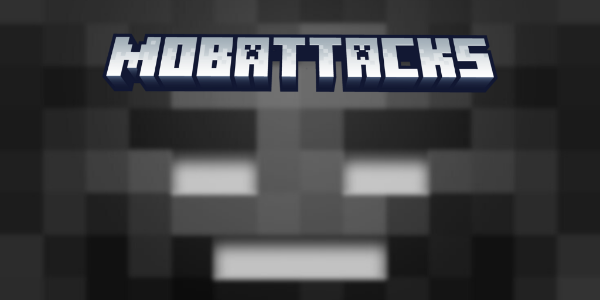

<h1 align="center">🧨 MobAttacks 🧨</h1>
<p align="center">
  
</p>

<p align="center">
  <strong>Unleash the powers of Minecraft mobs using customizable commands!</strong><br>
  A powerful Spigot plugin that brings thrilling PvP and mob-style attacks to your server.
</p>

<p align="center">
  <a href="https://github.com/MonkeyMoon104/MobAttacks/releases">
    
  </a>
  <a href="https://github.com/MonkeyMoon104/MobAttacks">
    
  </a>
  <a href="https://www.spigotmc.org/resources/1-17-1-21-mobattacks.127073/">
    
  </a>
  <a href="https://youtu.be/Pksujf_hzv8">
    
  </a>
</p>


---

## 🎮 About

**MobAttacks** is a dynamic and customizable plugin for Spigot servers that lets players perform unique attacks inspired by Minecraft’s most iconic mobs with just a command.

Whether you're planning intense PvP combat, minigames, or epic events, this plugin adds a new level of fun and strategy by mimicking mob abilities in real-time.

---

## 📽️ Demo Video

[](https://youtu.be/Pksujf_hzv8)

---

## ✨ Features

- 🔥 **11 Unique Mob Attacks** — From Creeper explosions to Enderman teleportation.
- ⚙️ **Fully Configurable** — Customize cooldowns, damage, and messages.
- 🔐 **Permission Based** — Assign specific attack powers to players or groups.
- 🚀 **Lightweight & Fast** — Designed for performance, with instant config reload.
- 🎯 **Perfect for PvP, Minigames, Roleplay & Events**

---

## ⚡ Commands

```bash
/mobattack reload         # Reload the config
/warden                   # Sonic Boom attack
/creeper                  # Explode like a Creeper
/ghast                    # Launch a fireball
/ravager                  # Charge forward
/shulker                  # Shoot levitation projectile
/blaze                    # Fire 3 fireballs
/evoker                   # Summon fang attack
/wither                   # Launch Wither skull
/edragon                  # Dragon's breath attack
/snowgolem                # Throw a snowball
/enderman                 # Teleport behind enemy
````

Each command includes support for **cooldowns**, **damage settings**, and **permissions**.

---

## 🛠️ Configuration (`config.yml`)

### ✅ Cooldowns

```yaml
cooldowns:
  warden: 5
  creeper: 10
  ghast: 7
  ravager: 6
  shulker: 8
  blaze: 5
  evoker: 6
  wither: 7
  edragon: 10
  snowgolem: 2
  enderman: 5
```

### 💥 Damage

```yaml
damage:
  warden: 10.0
  creeper: 20.0
  ghast: 6.0
  ravager: 8.0
  shulker: 4.0
  blaze: 5.0
  evoker: 6.0
  wither: 8.0
  edragon: 6.0
  snowgolem: 0.0
  enderman: 6.0
```

### 💬 Messages

Custom messages for each action:

```yaml
messages:
  warden-used: "&aYou unleashed the Sonic Boom!"
  creeper-used: "&aBOOM! Just like a Creeper."
  ghast-used: "&aYou launched a fireball!"
  # ... and more
```

---

## 🧾 Permissions

| Permission Node       | Description              | Default |
| --------------------- | ------------------------ | ------- |
| `mobattack.admin`     | Allows config reload     | OP      |
| `mobattack.warden`    | Use Warden attack        | OP      |
| `mobattack.creeper`   | Use Creeper explosion    | OP      |
| `mobattack.ghast`     | Use Ghast fireball       | OP      |
| `mobattack.ravager`   | Use Ravager charge       | OP      |
| `mobattack.shulker`   | Use Shulker projectile   | OP      |
| `mobattack.blaze`     | Use Blaze fireball burst | OP      |
| `mobattack.evoker`    | Use Evoker fang attack   | OP      |
| `mobattack.wither`    | Use Wither skull attack  | OP      |
| `mobattack.edragon`   | Use Ender Dragon breath  | OP      |
| `mobattack.snowgolem` | Use Snow Golem snowball  | OP      |
| `mobattack.enderman`  | Use Enderman teleport    | OP      |

---

## 📦 Installation

1. Download the latest version from the [Releases page](https://github.com/MonkeyMoon104/MobAttacks/releases).
2. Drop the `.jar` file into your server’s `/plugins` directory.
3. Restart or reload your server.
4. Customize `config.yml` as needed.
5. Assign permissions using your permissions plugin (e.g., LuckPerms).
6. Use `/mobattack reload` to apply changes.

---

## 🧠 Use Cases

* 🛡️ **PvP servers**: Give VIPs or events special mob powers.
* 🏰 **RPG or Faction**: Add tactical abilities to players.
* 🎉 **Minigames**: Add fun mob-based mechanics to custom games.
* 🧪 **Events/Admin Tools**: Let staff simulate custom mob abilities.

---

## 🧑‍💻 Author

Plugin developed by **[MonkeyMoon104](https://github.com/MonkeyMoon104)**
📧 Feel free to report issues or contribute via GitHub!

---

> Suggestions are welcome! Open an issue or feature request.

---

**🔗 Ready to bring your mobs to life? Download MobAttacks and let the chaos begin!**

